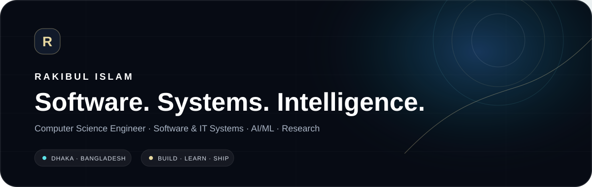

  

  
  
  
  

<h1 align="center">Rakibul Islam</h1>

  <strong>Executive Systems · Digital Growth · Applied Technology</strong> 
  I turn messy workflows, digital channels and technical systems into structured operations that are easier to manage, measure and scale.

  <code>OPERATIONS</code> × <code>GROWTH</code> × <code>SYSTEMS</code> × <code>RESEARCH</code>

---

## 01 / Operating Model

<table>
<tr>
<td width="25%" valign="top">

### 01 — Operate
Turn complexity into repeatable workflow.

`Planning` `SOPs` `Reporting` `Coordination`

</td>
<td width="25%" valign="top">

### 02 — Grow
Connect visibility, acquisition and measurement.

`SEO` `Google Ads` `Meta` `Lead Gen`

</td>
<td width="25%" valign="top">

### 03 — Build
Make technology fit the operation.

`Laravel` `PHP` `MySQL` `RBAC`

</td>
<td width="25%" valign="top">

### 04 — Research
Test ideas with data and evidence.

`AI/ML` `Data` `Research` `Review`

</td>
</tr>
</table>

> I work where **business execution, digital performance and software systems overlap** — so decisions are not separated from the tools and data that support them.

---

## 02 / Flagship Build

<table>
<tr>
<td width="58%" valign="top">

### 🏥 Evolved Clinic Management Platform
**Production operational system · Clinic workflows**

A live operational layer connecting patients, appointments, billing, stock, reporting, access control and day-to-day clinic workflows.

**What I work across**
- Patient and appointment workflows
- Billing, expenses and inventory
- Role-based access control and auditability
- Operational reporting and workflow checks
- Troubleshooting, implementation and user adoption

`PHP / Laravel` `MySQL` `RBAC` `Audit Logs` `Business Workflow`

[**View live system →**](https://myevolvedcms.com/) · [**Portfolio case study →**](https://rishuvro.github.io/#projects)

</td>
<td width="42%" valign="top">

### Current Signal

**IT Manager · Business Operations & Digital Growth**  
Evolved Aesthetics Clinic · Dhaka

I work across the clinic's operating layer — connecting internal systems, reporting, patient workflows, digital acquisition and everyday technology execution.

**Operate → Grow → Build**

</td>
</tr>
</table>

---

## 03 / Selected Systems & Projects

<table>
<tr>
<td width="50%" valign="top">

### 📦 Maitri Tally — POS & Inventory
Billing, inventory and showroom-reporting workflows connected to day-to-day sales operations.

`Laravel` `PHP` `MySQL` `JavaScript`

[Explore in portfolio →](https://rishuvro.github.io/#projects)

</td>
<td width="50%" valign="top">

### 🌐 SDS TechMed
B2B supplier website designed for credibility, structured services and lead capture.

`PHP` `Laravel` `Tailwind` `Hosting`

[Live project →](https://sdstechmed.com/) · [Repository →](https://github.com/rishuvro/sdstechmed)

</td>
</tr>
<tr>
<td width="50%" valign="top">

### 🫀 Heart Disease Prediction
Machine-learning project focused on predictive classification.

`Python` `Jupyter` `Machine Learning`

[Repository →](https://github.com/rishuvro/Heart_disease_prediction_using_AI)

</td>
<td width="50%" valign="top">

### 💧 Automatic Water Dispenser
Arduino-based automatic dispensing system using embedded-control logic.

`Arduino` `C++` `IoT`

[Repository →](https://github.com/rishuvro/Automatic_Water_Dispenser_System_Using_Arduino)

</td>
</tr>
<tr>
<td width="50%" valign="top">

### 🖥️ System Monitor
Python utility for monitoring CPU and memory usage.

`Python` `System Monitoring`

[Repository →](https://github.com/rishuvro/system_monitor_application_cpu-memory_using_python)

</td>
<td width="50%" valign="top">

### 🏙️ City of Gold — OpenGL
Computer-graphics project built with OpenGL and GLUT.

`C++` `OpenGL` `GLUT`

[Repository →](https://github.com/rishuvro/Computer_Graphics_Project_Building_City_of_Gold_using_OPENGL_glut)

</td>
</tr>
</table>

---

## 04 / Experience

| Period | Role | Organization | Focus |
|---|---|---|---|
| **Now** | **IT Manager · Business Operations & Digital Growth** | **Evolved Aesthetics Clinic** | Operations, digital acquisition, clinic systems, reporting |
| **2024–2025** | Business Operations, Digital Growth & IT Officer | SPST · Ministry of Social Welfare | Public-sector operations, reporting, digital, IT |
| **2024** | Software Engineer · Remote | Nonagon Infolytic | Laravel/PHP, MySQL, validation, REST APIs |
| **2023–2024** | Support Engineer | Icebreakers Ltd. | Enterprise support, troubleshooting, documentation |

[**Full experience →**](https://rishuvro.github.io/#experience)

---

## 05 / Research + Recognition

<table>
<tr>
<td width="55%" valign="top">

### 📄 IEEE Publication — ICECET 2024
**Hybrid Recommendation Systems using Adaptive Clustering to address Cold Start Problems**

Conference research exploring adaptive clustering for recommendation-system cold-start problems.

**DOI:** `10.1109/ICECET61485.2024.10698666`

[Google Scholar →](https://scholar.google.com/citations?hl=en&user=8-ZX2LYAAAAJ) · [ResearchGate →](https://www.researchgate.net/profile/Rakibul-Islam-97)

</td>
<td width="45%" valign="top">

### 🌍 ICCSC 2026 · Fez, Morocco
Conference service across scientific/review and organizing activities for the International Conference on Circuit, Systems and Communication.

`Scientific Service` `Research Review` `Organization`

[Research profile →](https://rishuvro.github.io/#research)

</td>
</tr>
<tr>
<td width="55%" valign="top">

### 📊 Open Research Data
**Dhaka Stock Exchange Historical Data**

Public dataset prepared for research and historical market analysis.

**DOI:** `10.17632/23553sm4tn.3`

</td>
<td width="45%" valign="top">

### 🔬 Research Direction
Recommendation systems · Applied AI · Computer vision · Intelligent business systems · Data-driven operations

</td>
</tr>
</table>

---

## 06 / Capability Map

### Operations
`Operational Planning` · `Workflow Coordination` · `Process Improvement` · `Documentation` · `SOPs` · `Reporting`

### Growth
`SEO` · `Google Ads` · `Meta Ads` · `Lead Generation` · `Landing Pages` · `Analytics` · `Search Console`

### Technology
`PHP` · `Laravel` · `JavaScript` · `MySQL` · `REST APIs` · `Admin Panels` · `CRM / POS / Inventory` · `Linux`

### AI / Data
`Python` · `scikit-learn` · `TensorFlow` · `Keras` · `PyTorch` · `pandas` · `NumPy` · `Jupyter`

---

## 07 / Education

**MSc in Information & Communication Technology**  
Bangladesh University of Professionals (BUP) · Dhaka · **Ongoing**

**BSc in Computer Science & Engineering**  
Southeast University · Dhaka · **Completed**

> Computer Science → Applied Systems → ICT Research

---

## 08 / GitHub Signal

  

  
  

---

## 09 / Connect

  
  
  
  

  <strong>OPERATE → GROW → BUILD → RESEARCH</strong> 
  Dhaka, Bangladesh · Building systems around real operations.

