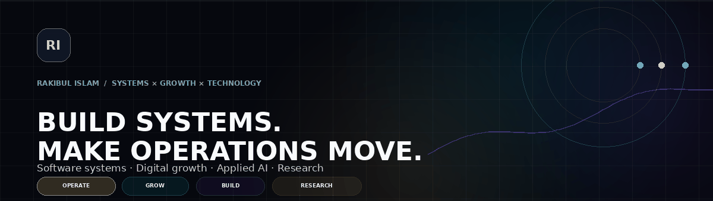
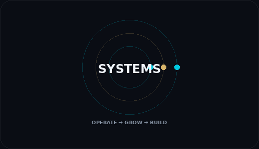

<p align="center">
  
</p>

<p align="center">
  <a href="https://rishuvro.github.io/"></a>
  <a href="https://www.linkedin.com/in/rishuvro"></a>
  <a href="https://scholar.google.com/citations?hl=en&user=8-ZX2LYAAAAJ"></a>
  <a href="mailto:rakibulislamshuvro@gmail.com"></a>
</p>

<p align="center">
  
</p>

<p align="center">
  
</p>

## ✦ About Me

<table>
<tr>
<td width="62%" valign="top">

I work where **software, business operations and digital performance meet**.

I build systems that make real operations easier to run — from patient workflows, inventory, billing and reporting to CRM, dashboards, digital acquisition and automation.

My goal is simple:

> **Build technology that makes the business move better.**

</td>
<td width="38%" valign="top">

<p align="center">
  
</p>

</td>
</tr>
</table>

---

## ⚡ Current Mode

<table>
<tr>
<td width="55%" valign="top">

### 🏥 Evolved Aesthetics Clinic

**IT Manager · Business Operations & Digital Growth**

- 🧩 Internal software & workflow systems
- 📊 Reporting and operational visibility
- 📈 SEO, Google Ads & Meta
- 🧠 CRM and patient-flow optimization
- ⚙️ Troubleshooting and process design

</td>
<td width="45%" valign="top">

### 🟢 LIVE SIGNAL

```text
STATUS     BUILDING
LOCATION   DHAKA, BD
FOCUS      SYSTEMS + PERFORMANCE
STACK      PHP / LARAVEL / MYSQL
RESEARCH   AI / RECOMMENDERS
MODE       OPERATE → GROW → BUILD
```

</td>
</tr>
</table>

---

## 🚀 Featured Work

<table>
<tr>
<td width="50%" valign="top">

### 🏥 Evolved Clinic Management Platform
Production operational system for patients, appointments, billing, stock, reporting and access control.

`Laravel` `PHP` `MySQL` `RBAC`

[Live system →](https://myevolvedcms.com/)  
[Case study →](https://rishuvro.github.io/#projects)

</td>
<td width="50%" valign="top">

### 📦 Maitri Tally
POS and inventory system connecting billing, stock and showroom reporting.

`Laravel` `PHP` `MySQL` `JavaScript`

[View project →](https://rishuvro.github.io/#projects)

</td>
</tr>

<tr>
<td width="50%" valign="top">

### 🌐 SDS TechMed
B2B supplier website built around credibility, structured services and lead capture.

`Laravel` `PHP` `Tailwind`

[Live site →](https://sdstechmed.com/)  
[Repository →](https://github.com/rishuvro/sdstechmed)

</td>
<td width="50%" valign="top">

### 🫀 Heart Disease Prediction
Machine-learning classification project for predictive health analysis.

`Python` `Jupyter` `ML`

[Repository →](https://github.com/rishuvro/Heart_disease_prediction_using_AI)

</td>
</tr>
</table>

<p align="center">
  <a href="https://github.com/rishuvro?tab=repositories">
    
  </a>
</p>

---

## 🧠 Experience

| | Role | Organization |
|---|---|---|
| 🟢 **Now** | **IT Manager · Business Operations & Digital Growth** | **Evolved Aesthetics Clinic** |
| 🟡 2024–2025 | Business Operations · Digital Growth · IT | SPST · Ministry of Social Welfare |
| 🟣 2024 | Software Engineer | Nonagon Infolytic |
| 🔵 2023–2024 | Support Engineer | Icebreakers Ltd. |

[Full experience →](https://rishuvro.github.io/#experience)

---

## 🔬 Research & Academic

<table>
<tr>
<td width="52%" valign="top">

### 📄 IEEE · ICECET 2024

**Hybrid Recommendation Systems using Adaptive Clustering to address Cold Start Problems**

`DOI: 10.1109/ICECET61485.2024.10698666`

[Google Scholar →](https://scholar.google.com/citations?hl=en&user=8-ZX2LYAAAAJ)

</td>
<td width="48%" valign="top">

### 🌍 ICCSC 2026 · Fez

Conference service across scientific/review and organizing activities.

`Scientific Service` `Review` `Organization`

</td>
</tr>

<tr>
<td width="52%" valign="top">

### 📊 Open Research Data

**Dhaka Stock Exchange Historical Data**

`DOI: 10.17632/23553sm4tn.3`

</td>
<td width="48%" valign="top">

### 🎓 Education

**MSc in ICT — Ongoing**  
Bangladesh University of Professionals

**BSc in CSE — Completed**  
Southeast University

</td>
</tr>
</table>

---

## 🛠️ Tech Arsenal

### 💻 Core Development
<p>
  
</p>

### 🤖 AI / Data / Systems
<p>
  
</p>

### ✦ Operating Skills


---

## 📡 GitHub Telemetry

<p align="center">
  
</p>

<p align="center">
  
  
</p>

<p align="center">
  
</p>

---

## 🌐 Connect

<p align="center">
  <a href="https://rishuvro.github.io/"></a>
  <a href="https://www.linkedin.com/in/rishuvro"></a>
  <a href="https://orcid.org/0009-0004-0055-9928"></a>
  <a href="mailto:rakibulislamshuvro@gmail.com"></a>
</p>

<p align="center">
  
</p>
