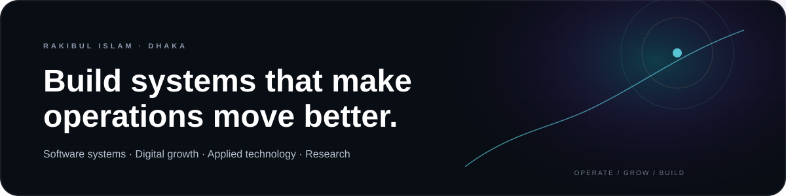

  

  <a href="https://rishuvro.github.io/">Portfolio</a>
  &nbsp;·&nbsp;
  <a href="https://www.linkedin.com/in/rishuvro">LinkedIn</a>
  &nbsp;·&nbsp;
  <a href="https://scholar.google.com/citations?hl=en&user=8-ZX2LYAAAAJ">Google Scholar</a>
  &nbsp;·&nbsp;
  <a href="https://www.researchgate.net/profile/Rakibul-Islam-97">ResearchGate</a>
  &nbsp;·&nbsp;
  <a href="mailto:rakibulislamshuvro@gmail.com">Email</a>

  

---

### About

I work where **software, operations and digital performance meet**.

Currently, I’m focused on building and improving operational systems for real businesses — from patient workflows, reporting and inventory to digital acquisition, dashboards and internal tools.

I care less about building software for its own sake and more about building systems that are **useful, measurable and maintainable**.

  

---

### Currently

<table>
<tr>
<td width="58%" valign="top">

**Evolved Aesthetics Clinic**  
*IT Manager · Business Operations & Digital Growth*

Working across internal software, reporting, patient operations, digital acquisition, CRM workflows and day-to-day technology execution.

</td>
<td width="42%" valign="top">

**Focus**

`Operational Software`  
`Laravel / PHP / MySQL`  
`Digital Growth`  
`AI / Recommendation Systems`

</td>
</tr>
</table>

---

### Featured work

<table>
<tr>
<td width="50%" valign="top">

#### Evolved Clinic Management Platform

Production operational software connecting patient management, appointments, billing, inventory, reporting and role-based access.

**Stack**  
`Laravel` `PHP` `MySQL` `RBAC`

[Live system](https://myevolvedcms.com/) · [Case study](https://rishuvro.github.io/#projects)

</td>
<td width="50%" valign="top">

#### Maitri Tally

POS and inventory workflows for billing, stock handling and showroom reporting.

**Stack**  
`Laravel` `PHP` `MySQL` `JavaScript`

[View project](https://rishuvro.github.io/#projects)

</td>
</tr>
<tr>
<td width="50%" valign="top">

#### SDS TechMed

B2B supplier website designed around credibility, structured services and lead capture.

**Stack**  
`Laravel` `PHP` `Tailwind`

[Live site](https://sdstechmed.com/) · [Repository](https://github.com/rishuvro/sdstechmed)

</td>
<td width="50%" valign="top">

#### Heart Disease Prediction

Machine-learning classification project focused on predictive analysis.

**Stack**  
`Python` `Jupyter` `Machine Learning`

[Repository](https://github.com/rishuvro/Heart_disease_prediction_using_AI)

</td>
</tr>
</table>

  <a href="https://github.com/rishuvro?tab=repositories">View all repositories →</a>

---

### Experience

**IT Manager · Business Operations & Digital Growth** — Evolved Aesthetics Clinic  
`Now`

**Business Operations · Digital Growth · IT** — SPST, Ministry of Social Welfare  
`2024–2025`

**Software Engineer** — Nonagon Infolytic  
`2024`

**Support Engineer** — Icebreakers Ltd.  
`2023–2024`

[Full experience →](https://rishuvro.github.io/#experience)

---

### Research

**IEEE ICECET 2024**  
*Hybrid Recommendation Systems using Adaptive Clustering to address Cold Start Problems*  
DOI: `10.1109/ICECET61485.2024.10698666`

**Open Research Data**  
*Dhaka Stock Exchange Historical Data*  
DOI: `10.17632/23553sm4tn.3`

**ICCSC 2026 · Fez, Morocco**  
Scientific / review / organizing conference service.

[Google Scholar](https://scholar.google.com/citations?hl=en&user=8-ZX2LYAAAAJ) ·
[ResearchGate](https://www.researchgate.net/profile/Rakibul-Islam-97) ·
[ORCID](https://orcid.org/0009-0004-0055-9928)

---

### Stack

  

`Software Systems` · `Operational Workflows` · `REST APIs` · `Databases` · `Automation` · `SEO` · `Google Ads` · `Meta Ads` · `Analytics`

---

### GitHub

  

  
  

---

  <b>Build useful systems. Keep them understandable.</b> 
  Dhaka, Bangladesh

